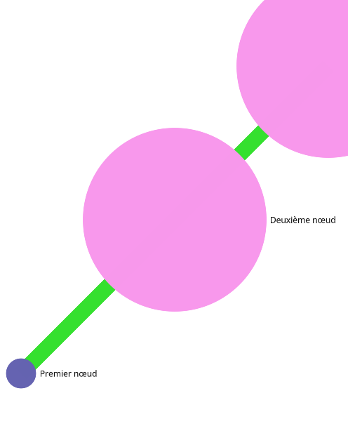

# Graph in 80% x 70vh , colors coded on 6 digits
## Code
```html
<div class="docsify-sigma" container-width="80%" container-height="70vh" min-node-size=5 max-node-size=30 edges-size=10 edges-color="#35E02F"></div>
```
## Rendered
<div class="docsify-sigma" container-width="80%" container-height="70vh" min-node-size=5 max-node-size=30 edges-size=10 edges-color="#35E02F"></div>

## Validation
<button id="test-button" type="button" class="primary">Run Tests</button>
| Test | Expect | Rendered | Validate |
|------|--------|----------|:--------:|
| Rendering |  | what's above | with your eyes |
| Width | <span id="expected-width"></span><br> | <span id="tested-width"></span><br> | <span id="compared-width"></span> |
| Height | <span id="expected-height"></span> | <span id="tested-height"></span> | <span id="compared-height"></span> |

<script>
    function runTests() {
        console.log("Running tests…");
        let docsigma = document.getElementsByClassName("docsify-sigma")[0];
        let expimage = document.getElementById("expected-image1");
        
        document.getElementById("tested-width").innerHTML = docsigma.offsetWidth;
        document.getElementById("expected-width").innerHTML = 0.8 * docsigma.parentElement.clientWidth;
        validate(docsigma.offsetWidth, 0.8 * docsigma.parentElement.clientWidth, "compared-width");

        document.getElementById("tested-height").innerHTML = docsigma.offsetHeight;
        document.getElementById("expected-height").innerHTML = 0.7 * window.innerHeight;
        validate(docsigma.offsetHeight, 0.7 * window.innerHeight, "compared-height");
        console.log("Tests completed! Check the results.");
    }
    
    function validate(firstValue, secondValue, resultFieldId) {
        document.getElementById(resultFieldId).innerHTML = Math.abs(firstValue - secondValue) <= 1 ? "✅" : "❌";
    }
    
    document.getElementById("test-button").addEventListener("click", runTests);
</script>

